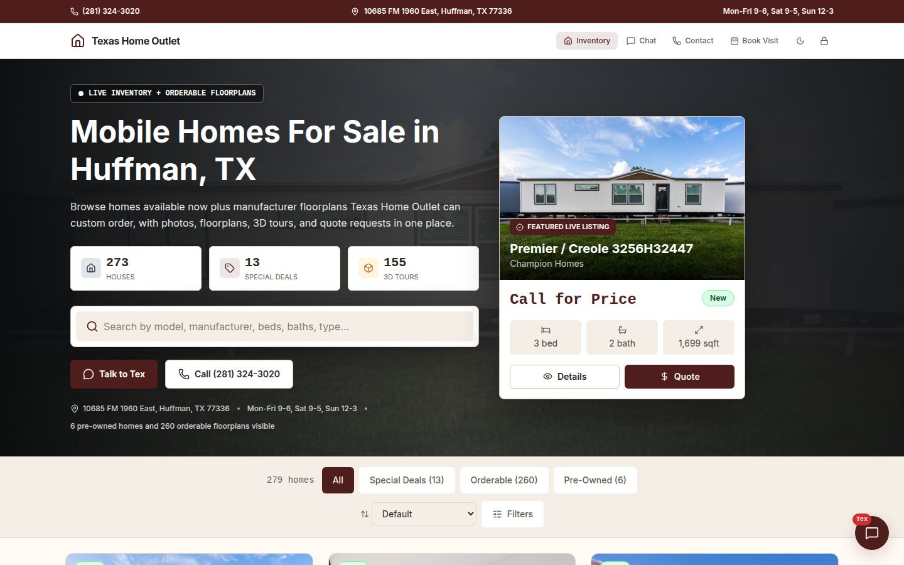
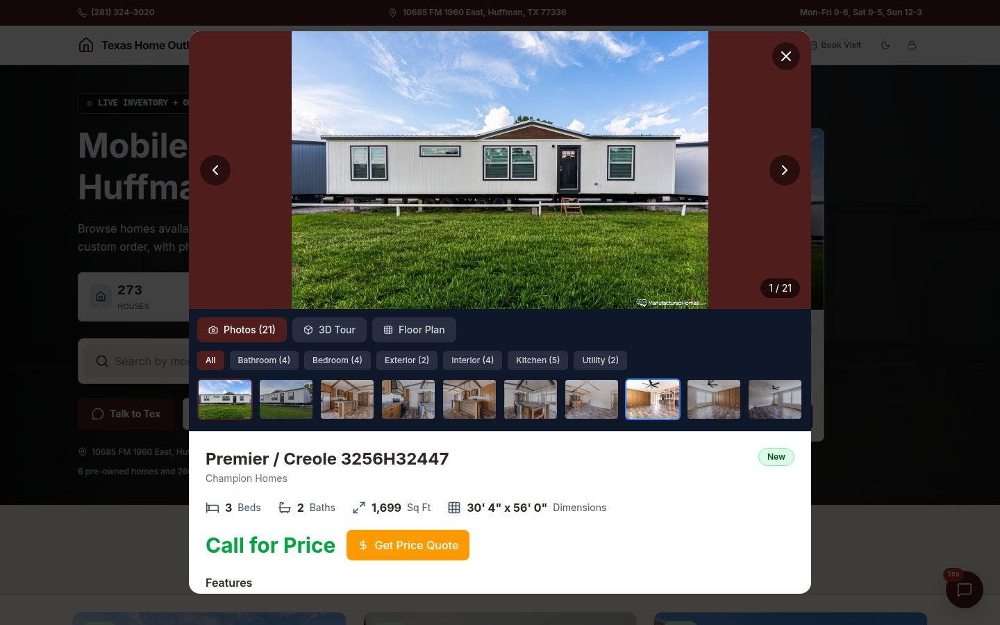
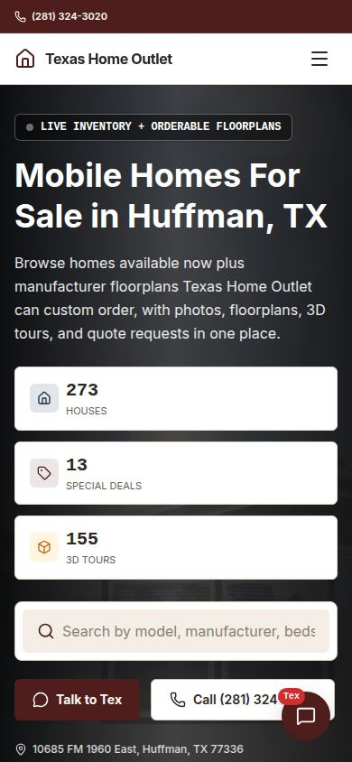
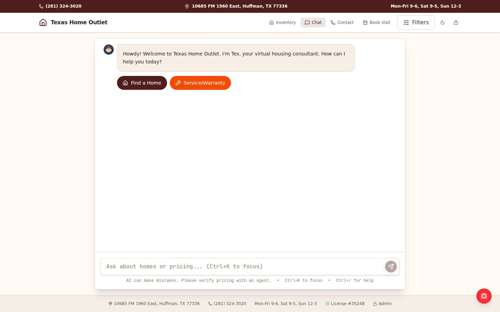
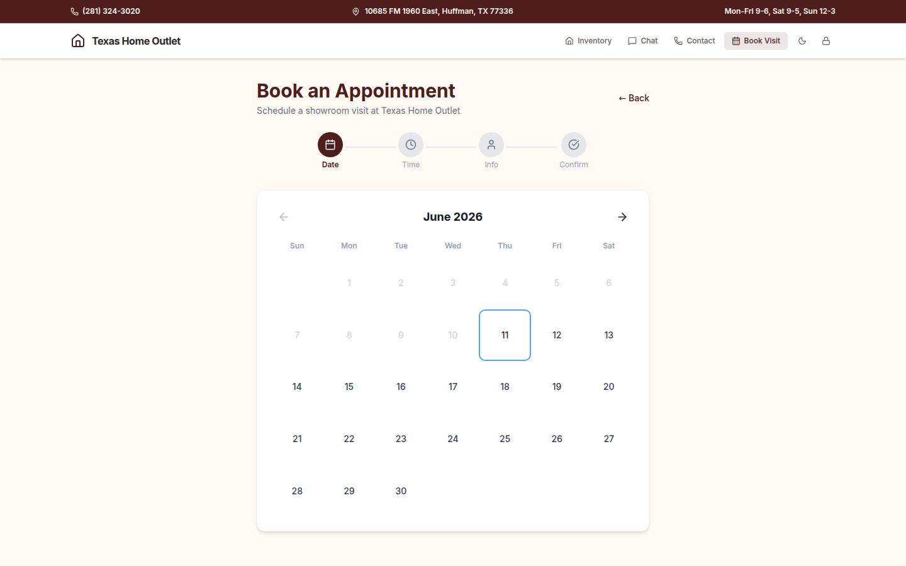
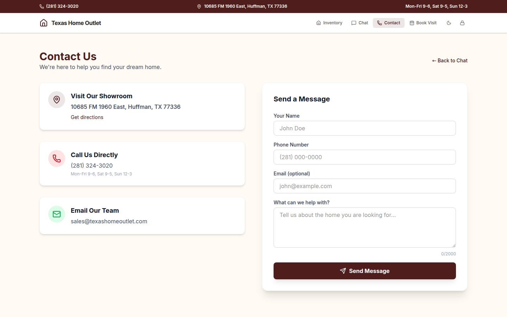
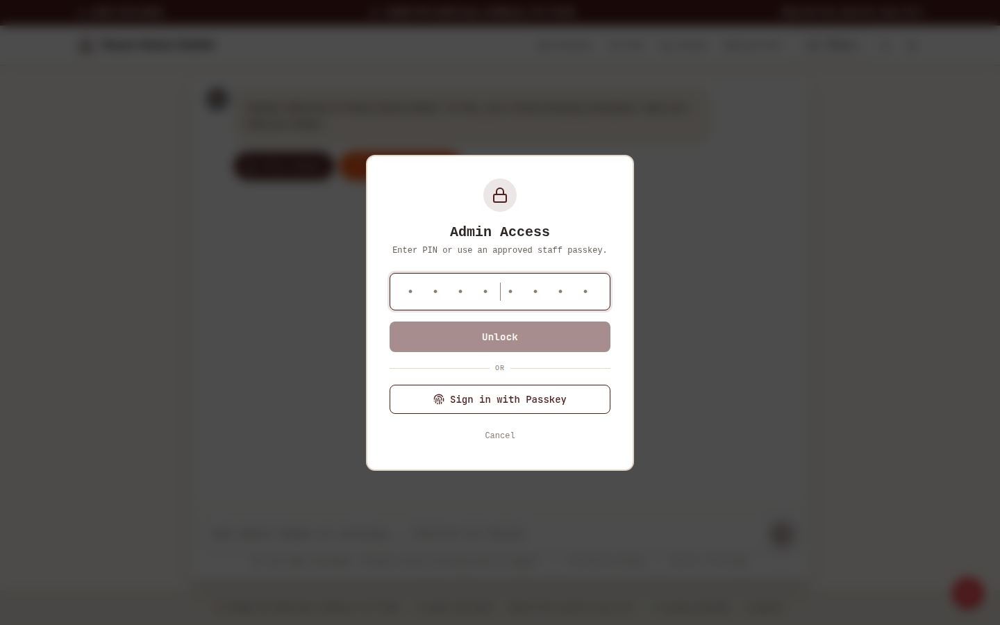
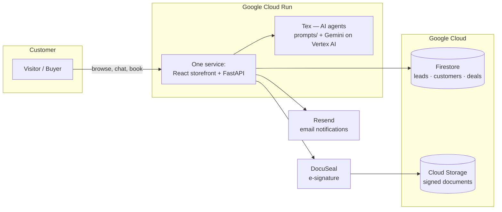

# Project Go Forward — Texas Home Outlet

**The digital storefront and back office for Texas Home Outlet — built, owned, and operated by the business instead of rented from third-party vendors.**

[](https://tho.sapphirealpha.xyz/)
[](tests/)
[](main.py)
[](frontend/)
[](root_agent.py)



## What is this?

One system that replaces several vendor subscriptions and manual processes:

| Before | Now |
|---|---|
| Website hosted and controlled by a third-party vendor | Our own site — we control content, speed, and search ranking |
| FastContractDocs for contract paperwork | Built-in Document Center generating the full TX regulatory packet |
| Leads scattered across calls, walk-ins, and sticky notes | Every lead captured, tracked, and followed up in one CRM |
| No after-hours coverage | **Tex**, an AI consultant who answers questions, searches inventory, and books showroom visits 24/7 |
| Marketing made one ad at a time | Ad Studio drafts campaigns from the home catalog |

It runs as a single service on Google Cloud and deploys automatically every time a
change is approved and merged in this repository.

## The customer experience

### Browse real inventory
Every home on the lot plus 260 orderable floorplans — photos, floor plans,
3D walkthroughs, and honest specs. Works just as well on a phone.

| Home detail with gallery + 3D tour | On a phone |
|---|---|
|  |  |

### Talk to Tex
Tex is the AI consultant — trained on our inventory, our hours, and our way of
talking to neighbors. Tex searches homes, answers questions in English or
Spanish, takes lead info, and books appointments. Tex is also honest: it only
quotes homes and prices from configured catalog data, never invents them
financing, and hands anything sensitive to a human.



### Book a visit, get in touch
Customers pick a real open slot — staff get notified instantly, and the
appointment lands in the CRM.

| Showroom booking | Contact |
|---|---|
|  |  |

## The staff side (behind the lock)

Staff surfaces — Document Center, CRM, Ad Studio, analytics — sit behind a
PIN + passkey gate. The Document Center fills the complete Texas
manufactured-housing closing packet (TMHA/TDHCA forms) from deal data and
sends it for e-signature with the federally required consent step.



## How it's built



Every change follows the same path: branch → pull request → 655 automated
tests must pass → human approval → merge → automatic deploy. Nobody — human
or AI — can push code straight to production.

## Trust, safety, and operations

- **655 automated tests** run on every change; the deploy is blocked if any fail
- **Branch protection** verified: direct pushes to production are rejected at the platform level
- **PII guardrails**: SSNs and financial data are stripped before anything reaches logs or the AI; Tex refuses to collect them in chat
- **Monitoring**: uptime checks, error alerts, daily Firestore backups, and a written [incident runbook](docs/RUNBOOK.md)
- **Search ranking protected**: all 279 indexed URLs from the old website stay alive here, with structured data the old site never had ([migration plan](docs/SEO_MIGRATION.md))
- **AI behavior is reviewable**: Tex's instructions are plain-English files in [`prompts/`](prompts/) — anyone can read exactly what the AI is told to do

## Key documents

| Document | What it covers |
|---|---|
| [`LAUNCH_READINESS.md`](LAUNCH_READINESS.md) | Go-live checklist with evidence — the honest status board |
| [`docs/RUNBOOK.md`](docs/RUNBOOK.md) | What to do when something breaks |
| [`docs/SEO_MIGRATION.md`](docs/SEO_MIGRATION.md) | How we keep (and improve) our Google ranking at cutover |
| [`docs/GCP_ENTERPRISE_PLAN.md`](docs/GCP_ENTERPRISE_PLAN.md) | Next phase: staff SSO, BigQuery dashboards, enterprise AI |
| [`docs/WALKTHROUGH.md`](docs/WALKTHROUGH.md) | Guided tour of this repository for presentations |
| [`docs/ARCHITECTURE.md`](docs/ARCHITECTURE.md) | Technical deep-dive |

## For developers

```bash
git clone https://github.com/arigatoexpress/Project-Go-Forward.git
cd Project-Go-Forward
python3.11 -m venv .venv && source .venv/bin/activate
pip install -r requirements.txt -r requirements-dev.txt
npm --prefix frontend install && npm --prefix frontend run build
python main.py   # http://127.0.0.1:8080
```

Checks before any PR: `python -m pytest tests/ -q` · `ruff check .` ·
`npm --prefix frontend run build` · `pre-commit run --files <changed>`.
Setup details: [`docs/DEV_SETUP.md`](docs/DEV_SETUP.md). Working agreements:
[`AGENTS.md`](AGENTS.md) and [`CLAUDE.md`](CLAUDE.md).
