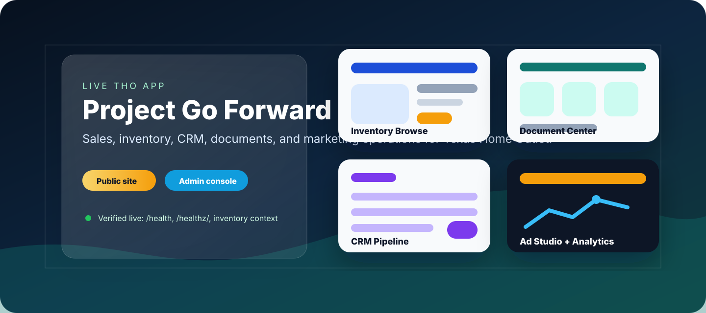
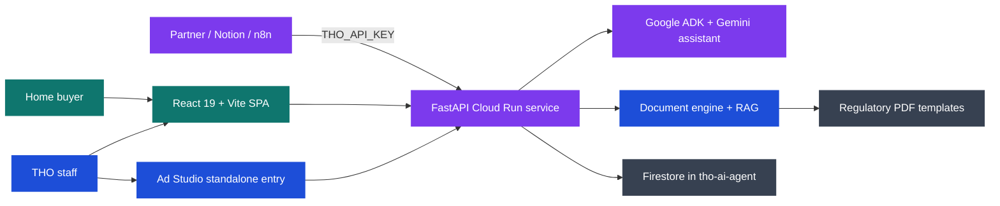

<div align="center">



# Project Go Forward

**The live Texas Home Outlet operating app: public storefront, AI sales assistant, inventory browser, CRM, Document Center, Analytics, and Ad Studio in one Cloud Run service.**

[](https://sapphirealpha.xyz/)
[](https://project-go-forward-trgi34bxuq-uc.a.run.app/)
[](frontend/)
[](main.py)
[](docs/README.md)

</div>

---

## What This Is

Project Go Forward is the production web app behind Texas Home Outlet's digital operating layer. It serves the customer-facing home-shopping experience at [sapphirealpha.xyz](https://sapphirealpha.xyz/), backs internal sales workflows, generates regulatory document packets, exposes partner-safe `/api/v1/*` contracts, and gives the team an Ad Studio for inventory-aware marketing.

The repo began as a configurable AI-agent framework; it is now a concrete THO product. This README is written for demo, diligence, and operator orientation.

**Verified live on April 29, 2026:** `https://sapphirealpha.xyz/health`, `/healthz/`, and `/api/marketing/inventory-context` returned HTTP 200, and the public inventory context returned 44 homes. The deployed `/healthz/` version is the source of truth for whether the live Cloud Run revision has caught up to the latest `main`.

## Live Surfaces

| Surface | Path | Access | Notes |
|---|---|---|---|
| Public storefront | [`/`](https://sapphirealpha.xyz/) | Public | Inventory browsing, AI assistant, comparison flow, contact and appointment entry points. |
| Public inventory context | `/api/marketing/inventory-context` | Public read-only | Inventory payload used by public and marketing experiences. |
| Contact, appointments, feedback | `/api/contact`, `/api/appointments`, `/api/feedback` | Public submit paths | Customer-facing form flows. Treat submitted data as PII. |
| Ad Studio | [`/studio`](https://sapphirealpha.xyz/studio), [`/studio.html`](https://sapphirealpha.xyz/studio.html) | Admin-gated data/actions | Inventory-aware campaigns, scripts, ideas, media, and marketing analytics. |
| Document Center | `/documents` | Admin-gated | Deal/customer lookup, template field mapping, batch packets, generated document history. |
| CRM | `/crm` | Admin-gated | Leads, customers, deals, appointments, tasks, email activity, and document actions. |
| Analytics | `/analytics` | Admin-gated | Lead, document, inventory, chat, and customer analytics. |
| Partner API | `/api/v1/*` | `THO_API_KEY` required | Customers, inventory, leads, stats, webhook notify, and regulatory RAG query contract. |
| Health | [`/health`](https://sapphirealpha.xyz/health) | Public operator check | Readiness endpoint. |
| Liveness | [`/healthz/`](https://sapphirealpha.xyz/healthz/) | Public operator check | Cloud Run liveness. Use the trailing slash in external smoke checks. |

## Product Map

| Capability | Product surface | Code paths |
|---|---|---|
| Public inventory and AI assistant | Storefront SPA, property cards, comparison drawer, chat | [frontend/src/App.jsx](frontend/src/App.jsx), [frontend/src/pages/InventoryBrowse.jsx](frontend/src/pages/InventoryBrowse.jsx), [tools/inventory_tools.py](tools/inventory_tools.py) |
| CRM and sales operations | Leads, customers, deals, appointments, email activity, document actions | [frontend/src/pages/CRM.jsx](frontend/src/pages/CRM.jsx), [lead_management.py](lead_management.py), [database/models.py](database/models.py), [main.py](main.py) |
| Document generation | Field-map driven PDF packets and downloads | [frontend/src/pages/DocumentCenter.jsx](frontend/src/pages/DocumentCenter.jsx), [config/field_map.json](config/field_map.json), [tools/document_engine.py](tools/document_engine.py), [tools/document_tools.py](tools/document_tools.py) |
| Marketing studio | Inventory-aware scripts, social ideas, analytics, creative workflow | [frontend/src/pages/AdStudio.jsx](frontend/src/pages/AdStudio.jsx), [frontend/src/entries/studio.jsx](frontend/src/entries/studio.jsx), [tools/marketing_tools.py](tools/marketing_tools.py) |
| Analytics | Lead, document, inventory, customer, and chat analytics | [frontend/src/pages/Analytics.jsx](frontend/src/pages/Analytics.jsx), [analytics_service.py](analytics_service.py), [main.py](main.py) |
| Partner API | `/api/v1/customers`, `/inventory`, `/leads`, `/stats`, `/webhooks/notify`, `/rag/query` | [main.py](main.py), [docs/SECURITY.md](docs/SECURITY.md), [docs/RAG_INTEGRATION.md](docs/RAG_INTEGRATION.md) |
| Regulatory RAG | Semantic search over document templates for partner workflows | [tools/document_rag.py](tools/document_rag.py), [docs/RAG_INTEGRATION.md](docs/RAG_INTEGRATION.md) |

## Recent Production-Reality Updates

These docs are refreshed after PRs #25, #28, and #29:

- Document Center fill data is normalized before batch validation, so raw UI form data and CRM deal-generated packets use the same required-field shape.
- `scripts/production_smoke.py` is the read-only public smoke for `/health`, `/healthz/`, SPA routes, inventory payload shape, and unauthenticated admin-route protection.
- Admin access uses `ADMIN_PIN_HASH`. The plaintext PIN is not recoverable from production and must not be pasted into chat, email, tickets, screenshots, or docs.
- PIN verification and rotation are operator-only flows. Use [docs/PIN_ROTATION_RUNBOOK.md](docs/PIN_ROTATION_RUNBOOK.md) without recording PINs, tokens, or hashes.

## Architecture



## Demo In Three Minutes

1. Open [sapphirealpha.xyz](https://sapphirealpha.xyz/) and show customer-facing inventory, search, comparison, and chat.
2. Open [sapphirealpha.xyz/studio](https://sapphirealpha.xyz/studio) to show the marketing workflow tied to live inventory context. Stop before any action that needs credentials unless the audience is authorized.
3. Open `/documents`, `/crm`, or `/analytics` only with admin credentials and only for an approved internal audience.
4. Use [docs/SHOWCASE.md](docs/SHOWCASE.md) for a tighter script, fallback talking points, and screenshot safety notes.

## Safety And Data Boundaries

- Public surfaces are safe to show without credentials, but customer submissions and inventory-derived workflows can still expose operational context.
- Admin surfaces are gated; do not share `/documents`, `/crm`, `/analytics`, or Ad Studio admin actions without the intended credentials.
- Partner endpoints under `/api/v1/*` require `THO_API_KEY` or the configured integration token.
- PII must not be logged or sent to Gemini without sanitation; see [tools/pii_guard.py](tools/pii_guard.py) and [docs/SECURITY.md](docs/SECURITY.md).
- Firestore lives in the `tho-ai-agent` project; DNS for `sapphirealpha.xyz` lives in `sapphire-479610`.
- Regulatory originals in `tho_documents/` are source documents and should not be modified casually.

## Quick Start

```bash
cd /Users/aribs/Code/Project-Go-Forward
python3.11 -m venv .venv
source .venv/bin/activate
pip install -r requirements.txt -r requirements-dev.txt
npm --prefix frontend install
npm --prefix frontend run build
python main.py
```

Local app: [http://127.0.0.1:8080](http://127.0.0.1:8080)

Focused local checks:

```bash
python -m pytest tests/test_healthz.py tests/test_api_v1.py tests/test_document_engine.py -q
npm --prefix frontend run build
ruff check .
```

## Production Verification

Texas Home Outlet production runs on Cloud Run service `project-go-forward` in project `tho-ai-agent`, region `us-central1`, and is published at `https://sapphirealpha.xyz`.

Use the production runbook and read-only smoke before making live claims:

```bash
export THO_PROD_URL="https://sapphirealpha.xyz"
python3 scripts/production_smoke.py --base-url "$THO_PROD_URL"
curl -fsS "$THO_PROD_URL/health" | python3 -m json.tool
curl -fsS "$THO_PROD_URL/healthz/" | python3 -m json.tool
curl -fsS "$THO_PROD_URL/api/marketing/inventory-context" | python3 -m json.tool
```

See [docs/PRODUCTION_READINESS.md](docs/PRODUCTION_READINESS.md) for the full local gate list, admin token commands, rotation path, Cloud Run log checks, and rollback commands. Rollback and operator navigation also live in [AGENTS.md](AGENTS.md). Deployment-sensitive changes should use a draft PR unless Ari explicitly authorizes merge/deploy.

## Documentation

Read [docs/README.md](docs/README.md) first. The shortest path:

1. [docs/SHOWCASE.md](docs/SHOWCASE.md) - demo script, live URLs, and what to show.
2. [docs/PRODUCTION_READINESS.md](docs/PRODUCTION_READINESS.md) - smoke checks, local gates, admin-token handling, and rollback.
3. [docs/PIN_ROTATION_RUNBOOK.md](docs/PIN_ROTATION_RUNBOOK.md) - operator-only PIN hash rotation without disclosing the PIN.
4. [docs/ARCHITECTURE.md](docs/ARCHITECTURE.md) - system overview, Cloud Run, Firestore, deployment, repo layout.
5. [docs/WORKFLOWS.md](docs/WORKFLOWS.md) - lead, document, appointment, CI/CD, and inventory workflows.
6. [docs/DATA_MODEL.md](docs/DATA_MODEL.md) - Firestore collections and relationships.
7. [docs/SECURITY.md](docs/SECURITY.md) - auth model, PII handling, API keys, and least privilege.
8. [docs/RAG_INTEGRATION.md](docs/RAG_INTEGRATION.md) - regulatory PDF search contract.

## Repo Layout

```text
Project-Go-Forward/
├── main.py                         # FastAPI service, API routes, SPA hosting
├── root_agent.py                   # Google ADK agent orchestration
├── config.yaml                     # THO business configuration
├── frontend/src/                   # React app, public app, and admin surfaces
├── database/                       # Firestore client and Pydantic models
├── tools/                          # Inventory, CRM, document, marketing, RAG tools
├── schemas/                        # Request/response and document schemas
├── config/field_map.json           # PDF template field registry
├── tho_documents/                  # Regulatory PDF originals
├── docs/                           # Canonical documentation
└── tests/                          # Backend tests and smoke coverage
```
