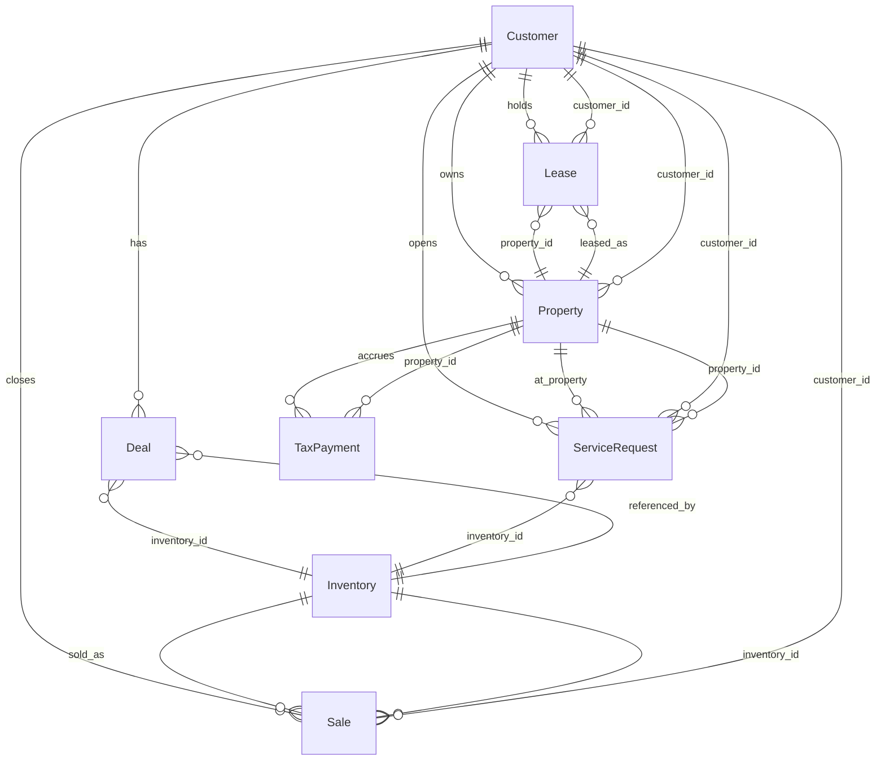

# THO App — Data Model

All persistent data lives in **Firestore** inside the `tho-ai-agent` project. The env var `GOOGLE_CLOUD_PROJECT=tho-ai-agent` wires the client at `database/firestore_client.py:15`.

## Collection map

| Collection | Entity | Doc ID | Backed by model |
|-----|-----|-----|-----|
| `customers/` | Customer | UUIDv4 | `database/models.py:27` |
| `deals/` | Deal (consolidated sales application) | UUIDv4 | `database/models.py:180` |
| `inventory/` | Inventory (home listing) | UUIDv4 or listing ID | `database/models.py:78` |
| `properties/` | Property (post-sale physical home at a location) | UUIDv4 | `database/models.py:62` |
| `sales/` | Sale (closed contract) | UUIDv4 | `database/models.py:117` |
| `leases/` | Lease (ongoing rental/financing) | UUIDv4 | `database/models.py:156` |
| `tax_payments/` | TaxPayment | UUIDv4 | `database/models.py:178` |
| `service_requests/` | ServiceRequest / warranty claim | UUIDv4 | `database/models.py:432` |
| `projects/` | Internal PM project (Linear-style) | UUIDv4 | `database/models.py:517` |
| `tasks/` | Task (PM) | UUIDv4 | `database/models.py:553` |
| `cycles/` | Sprint/cycle (PM) | UUIDv4 | `database/models.py:617` |
| `activities/` | Audit-log entry | UUIDv4 | `database/models.py:646` |

## Core business entities

### Customer — `customers/`

Directory-level record for anyone the business is engaged with.

| Field | Type | Notes |
|-----|-----|-----|
| `id` | UUIDv4 | Doc ID |
| `full_name` | string | required |
| `_name_lower` | string | **computed** on write for prefix search |
| `phone` | string? | 10+ digit validation |
| `email` | string? | RFC-validated |
| `status` | enum | `ENROLLED` \| `NON_ENROLLED` \| `LEAD` \| `SOLD` |
| `billing_account` | string? | e.g. `Prosperity Acquisitions LLC - 15th` |
| `created_at` / `updated_at` | datetime | UTC |

**PII**: `full_name`, `phone`, `email`. Scrubbed by `pii_guard.py` before logs or LLM prompts.

### Deal — `deals/`

Consolidated sales-application record. One Deal maps 1:1 to a sales transaction. Drives the PDF document engine.

Grouped by section:

- **Identity**: `id`, `status` (`pending` \| `approved` \| `contract` \| `funded` \| `complete` \| `denied` \| `archived`), `salesrep`
- **Buyer** (PII): `buyer_first_name`, `buyer_last_name`, `buyer_phone`, `buyer_email`, **`buyer_ssn`**, `buyer_marital_status`
- **Co-buyer** (PII): `co_buyer_*` (same shape as buyer)
- **Employment**: `employer_name`, `occupation`, `occupation_length`, `work_phone`, `self_employed`, `previous_*`, `co_buyer_*`
- **Addresses**: `mailing_*` (address, city, state, zip, length, own_rent), `buyer_*` (address, city, county, state, zip)
- **References** (PII): `reference1_name`, `reference1_phone`, `reference2_*`
- **Home**: `inventory_id`, `manufacturer`, `model`, `year`, `serial_number_1/2`, `label_number_1/2`, `no_of_sections`, `is_new`
- **Pricing**: `sales_price`, `down_payment`
- **Financing**: `creditor_name`, `creditor_address`, `creditor_city_state_zip`, `creditor_phone`, `loan_term`, `apr`, `finance_charge`, `max_financed`, `total_payments`, `payment_start_date`, `insurance_premium`
- **Timestamps**: `created_at`, `updated_at`
- **Computed** (via `Deal.to_document_data()`): `buyer_name`, `co_buyer_name`, `buyer_city_state_zip`, `buyer_full_address`, `mailing_city_state_zip`, `mailing_full_address`, `manufacturer_model`, `serial_label_combined`, `new_used_text`, `unpaid_balance`

**PII / sensitive**: `buyer_ssn`, `co_buyer_ssn`, all `*_phone`, all `*_email`. Stripped by `_strip_pii_from_deal()` before returning to non-admin clients.

### Inventory — `inventory/`

Home listings shown on the storefront and used to populate a Deal's Home section.

| Field | Type | Notes |
|-----|-----|-----|
| `id` | UUIDv4 \| listing ID | Doc ID |
| `serial_number` | string | required |
| `model_name` | string | required |
| `manufacturer` | string? | |
| `manufacturer_id` | string? | CDN key |
| `plan_id` | string? | CDN key |
| `invoice_date` / `invoice_amount` / `msrp` | float? | |
| `bedrooms` / `bathrooms` / `sqft` / `width` / `length` | int? | |
| `year` | int? | |
| `is_new` | bool? | |
| `status` | enum | `AVAILABLE` \| `SOLD` \| `PENDING` \| `RESERVED` |
| `condition` | string? | `New` / `Used` / … |
| `image_url` / `hero_image` | string? | CDN URL |
| `photos` | string[] | array of CDN URLs |
| `floorplan_url` | string? | |
| `location` | string? | e.g. `San Antonio, TX` |
| `date_added` | ISO-8601 string | |
| `source_url` | string? | |

### Property — `properties/`

Physical home at a location post-sale. Tax records attach here.

`id`, `address`, `city`, `state`, `zip_code`, `county`, `school_district`, `county_account_number`, `county_tax_link`, `isd_tax_link`, `customer_id?`.

### Sale — `sales/`

Closed contract. Bridges Customer ↔ Inventory at the point of transaction.

`id`, `customer_id`, `inventory_id`, `salesman?`, `customer_number?`, `sale_date?`, `sale_price?`, `down_payment?`, `financed_amount?`, `monthly_payment?`, `loan_term_months?`, `interest_rate?`, `contract_status` (`pending` \| `approved` \| `funded` \| `complete`).

### Lease — `leases/`

Ongoing rental or rent-to-own. Drives AR/billing.

`id`, `customer_id`, `property_id`, `monthly_payment`, `lease_start_date?`, `lease_end_date?`, `billing_account?`, `payment_day` (1–31), `status` (`active` \| `delinquent` \| `paid_off` \| `terminated`).

### TaxPayment — `tax_payments/`

`id`, `property_id`, `tax_year`, `county_taxes?`, `school_taxes?`, `total_taxes?`, `escrow_balance?`, `payment_date?`.

### ServiceRequest — `service_requests/`

Post-sale issue / warranty claim. This is the territory that the **Notion Installation & Service Tracker** will mirror (see [INTEGRATION_NOTION.md](INTEGRATION_NOTION.md)).

`id`, `customer_id`, `property_id?`, `inventory_id?`, `issue_type`, `description`, `photos[]`, `is_warranty_claim` (bool), `warranty_status?`, `warranty_notes?`, `status` (`open` \| `in_progress` \| `scheduled` \| `resolved` \| `closed`), `assigned_contractor?`, `resolution_notes?`, `resolved_date?`, `created_at`, `updated_at`.

## PM entities (Linear-inspired, internal)

These support the engineering/ops workstream, not customer-facing flows. Noted here for completeness; **not part of the Notion integration surface**.

- **Project** — `id`, `name`, `project_type` (`software`/`business`/`research`/`infrastructure`), `github_repo?`, `cloud_run_service?`, `notion_url?`, `status`, `owner`, `members[]`, `total_tasks`, `completed_tasks`, `default_branch?`, `deployment_url?`
- **Task** — `id`, `title`, `description?`, `project_id`, `state` (`backlog`/`todo`/`in_progress`/`in_review`/`done`/`cancelled`/`blocked`), `priority` (0–4), `assignee?`, `creator`, `labels[]`, `parent_task_id?`, `related_github_issue?`, `related_github_pr?`, `related_deal_id?`, `estimate_hours?`, `actual_hours?`, `due_date?`, `started_at?`, `completed_at?`, `state_history[]`
- **Cycle** — sprint; `start_date`, `end_date`, `goals`, `project_ids[]`
- **Activity** — append-only audit log

## Entity relationships

## Canonical ID scheme

- **All IDs are Firestore document IDs** (UUIDv4 for most, listing numbers for inventory).
- **Deal ID is the shared business key** between the THO app and any external system (Notion, n8n, Etai's workspace). Do not re-mint IDs in external systems — reference the Firestore Deal ID.
- **Customer ID is the shared customer key**. When multiple systems need the same customer, use this ID.
