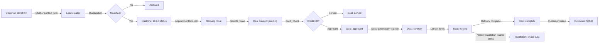
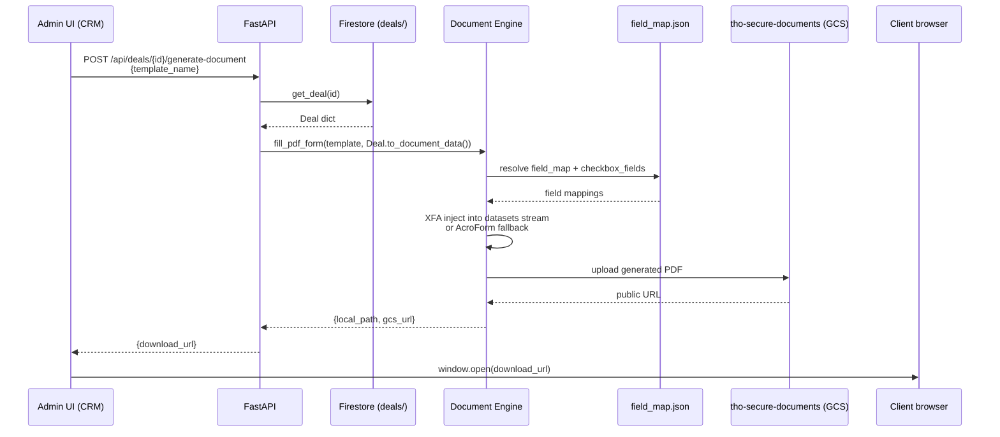
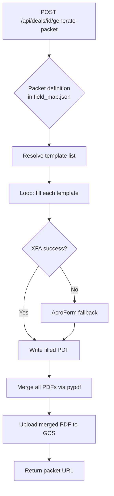
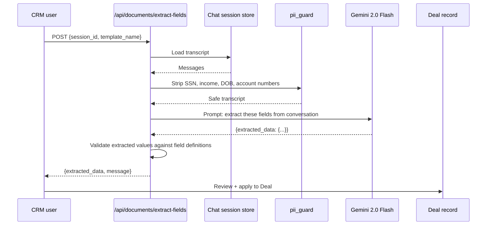
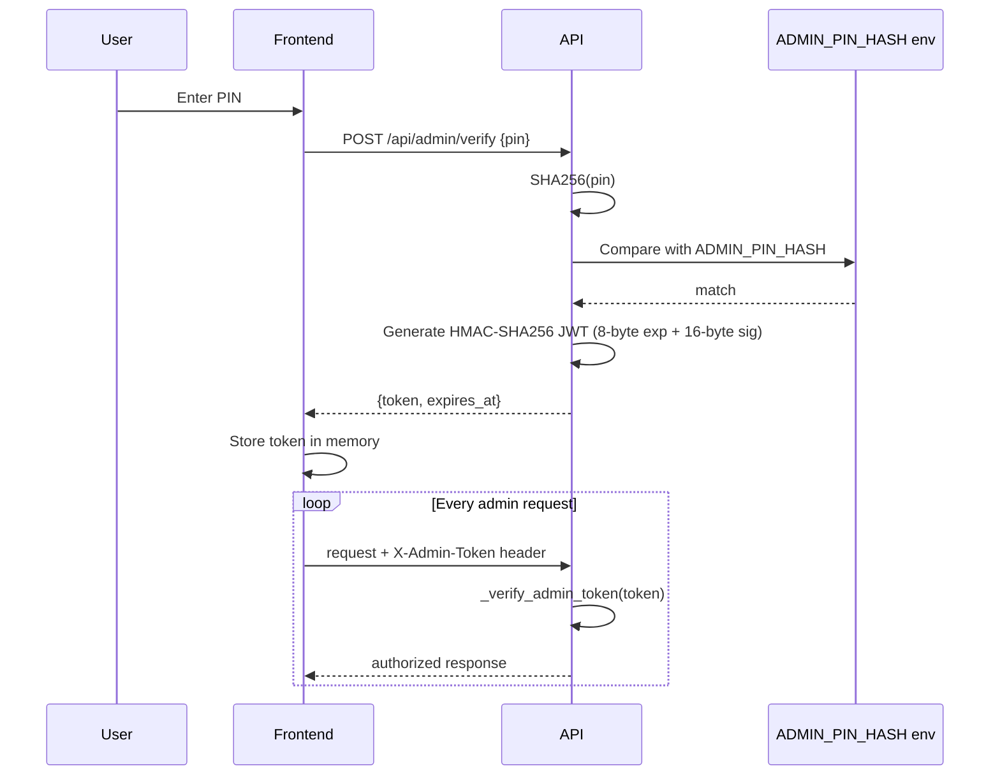
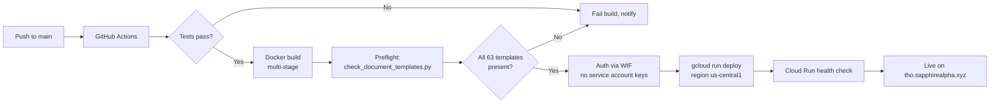
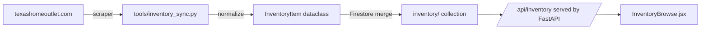
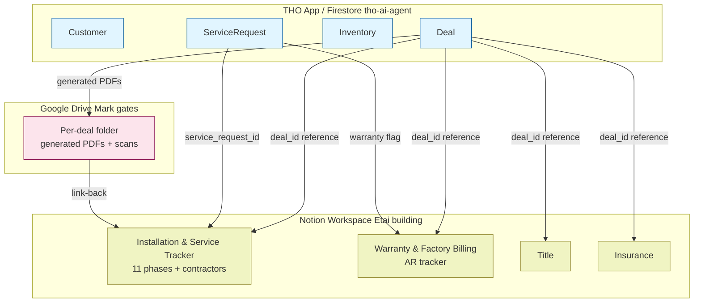

# THO App — Workflows

Diagrams are [Mermaid](https://mermaid.js.org/). GitHub renders them inline.

## 1. Lead → Customer → Deal → Funded

The core sales funnel.

**Key transitions**:
- Customer status flips to `SOLD` when any associated Deal reaches `complete`.
- The Notion Installation Tracker picks up the Deal at `funded` and drives the 11-phase delivery process.

## 2. Document generation

What happens when a CRM user clicks "Generate" on a deal card.

**Template categories** (in `config/field_map.json`):
- **TMHA** — Texas Manufactured Housing Association sales contracts
- **TDHCA** — Texas Department of Housing & Community Affairs (20+ disclosure forms)
- **State** — state-level compliance (CreditAuth, PatriotAct, …)
- **Internal** — THO-specific (Homestead, Arbitration, CheckDraftAuth, …)

**Output location**: `gs://tho-secure-documents/generated_docs/{filename}` in production (`GCS_DOCUMENTS_BUCKET` env var). Local dev falls back to `./data/generated_docs/`.

## 3. Document packet (multi-template)

When a closing packet (10–20 documents) is needed:

## 4. AI-powered form extraction

Used when a sales rep has been chatting with a customer and wants to auto-populate Deal fields.

**Guardrail**: PII fields (`buyer_ssn`, `co_buyer_ssn`, financial account numbers) are **never** sent to the LLM. `form_extraction.py` filters them from both the transcript and the field list.

## 5. Admin auth

Stateless JWT via shared secret. No database lookup on the hot path.

**Token**: 24 bytes (8-byte BE uint64 expiry + 16-byte HMAC tag), base64 → ~32 chars. TTL default 2h (`ADMIN_TOKEN_TTL`). Secret derivation: `SHA256(f"sapphire-jwt-{ADMIN_PIN_HASH[:16]}")`.

## 6. Deployment (CI/CD)

## 7. Inventory sync

External website (texashomeoutlet.com) → storefront.

**Run**: `python tools/inventory_sync.py [--dry-run] [--force]`. Merges rather than overwrites, so manual edits in Firestore are preserved unless `--force` is set.

## 8. Cross-system integration — where Notion fits

This is the integration contour for Etai's Notion workspace. Details in [INTEGRATION_NOTION.md](INTEGRATION_NOTION.md).

**Canonical rule**: the Deal lives in Firestore; Notion holds the operational workflow around it. IDs flow from THO app → Notion, never the reverse.

*Last verified: 2026-05-04*
