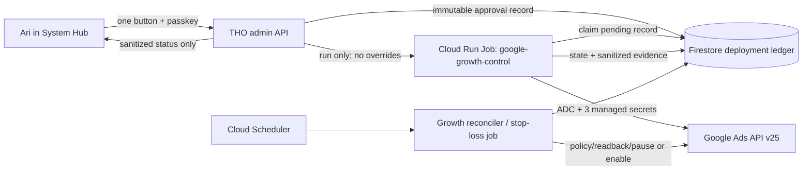

# Claude handoff — one-click Google Ads deployment

> **SUPERSEDED — historical design only.** The authoritative implementation
> boundary is `docs/runbooks/google-growth-activation.md`. Storefront
> `run.jobs.run` is forbidden; automatic enablement is forbidden; and no
> activation or spend operation is part of the current PAUSED-only job. Do not
> implement the older authority model described below.

Date: 2026-07-28  
Repository: `arigatoexpress/Project-Go-Forward`  
Owner: Ari  
Implementation target: a production-quality, owner-only button that can deploy
and activate one pre-reviewed Google Search campaign from THO's admin UI.

## 1. Mission

Build the shortest safe path from a reviewed campaign contract to revenue:

> When every account, policy, measurement, and landing-page prerequisite is
> proven, Ari presses one clearly labeled button, completes a passkey prompt,
> and the system creates the entire campaign paused, waits for Google's policy
> review, enables it automatically under the exact approved caps, records every
> transition, and pauses it automatically if a stop-loss fires.

This is "one click from ready," not "skip setup." The checked-in integration
must remain inert while prerequisites are missing.

The owner click is the spend authorization. Agents, CI, scheduled jobs, merges,
deployments, API probes, and readiness checks must never substitute for it.
Claude may implement, test, push, open PRs, and merge green code, but Claude
must not execute an Ads mutation against the production account, populate
credentials, press the launch button, or enable spend.

## 2. Authoritative current state

Re-check all of this before implementation; do not assume it remained static.

### Repository and deployment

- Work from a fresh branch based on `origin/main`, currently
  `24e1e88c8a4f5700a98cfb394e4283fda6d50161`.
- The primary local clone's `main` is one commit ahead at `bb34313`. Do not
  silently include or discard that local commit. Use `origin/main` or a fresh
  worktree.
- Cloud Run production traffic is currently 100% on
  `project-go-forward-00412-hiy`.
- The latest zero-traffic candidate is `project-go-forward-00417-but`, tagged
  `candidate`.
- The latest `origin/main` GitHub deployment workflow completed successfully:
  run `30174667978`.
- This repository deploys every merge to `main` as a zero-traffic candidate.
  Do not change production traffic as part of this feature.

### Existing growth assets

Keep and extend these rather than starting a parallel subsystem:

- `config/google_ads_launch_draft.json`
  - schema version 2
  - `VALIDATE_ONLY`
  - campaign, ad groups, and ads all `PAUSED`
  - reviewed average daily budget: $20
  - disclosed maximum single-day charge: $40
  - disclosed monthly charging limit: $608
  - reviewed max CPC: $5
  - 50-mile radius
  - Google Search only; Search Partners and Display off
  - exact/phrase positive keywords
  - housing-targeting restrictions encoded
  - stop-loss encoded
- `scripts/google_ads_launch_draft.py`
  - offline, deterministic, zero-network validator
  - currently refuses all approval or serving state
- `scripts/google_ads_access_probe.py`
  - sanitized read-only live account probe using keyless ADC
  - currently calls Google Ads API v24
- `scripts/google_growth_readiness.py`
  - read-only GCP/API/secret/runtime presence audit
- `docs/runbooks/google-growth-activation.md`
- `tests/test_google_ads_launch_draft.py`
- `tests/test_google_ads_access_probe.py`
- `tests/test_google_growth_readiness.py`
- first-party UTM/click-ID/lead/conversion plumbing already present in the
  storefront and CRM.

### Live readiness result on 2026-07-28

The offline launch draft validates, but every live prerequisite is absent:

```json
{
  "draft_valid": true,
  "spend_enabled": false,
  "ads_api": false,
  "ads_account_config": false,
  "ads_auth_path": false,
  "account_access_validated": false,
  "measurement": false,
  "measurement_apis": false,
  "business_profile_apis": false,
  "seo_api": false,
  "dedicated_service_account": false,
  "dedicated_job": false,
  "managed_secret_bindings": false,
  "google_ads_secrets": false,
  "ready_to_spend": false
}
```

Therefore, the merged UI must initially show a disabled launch button with
specific remediation items. No code path may infer approval from the checked-in
$20 proposal.

## 3. Product decision: what "one click" means

Place a Google Ads launch card in `frontend/src/pages/SystemHub.jsx`, not in the
customer storefront and not beside low-risk creative-generation controls.
Ad Studio may link to the card, but System Hub is the high-risk operations
surface.

When ready, display one primary control with the consequence in the control
itself:

> **Deploy & enable Search — $20/day average, up to $40/day, $608/month**

Required supporting copy:

- "Creates the reviewed campaign paused."
- "Automatically enables it only after Google policy approval and all launch
  checks remain green."
- "Maximum CPC: $5."
- "Emergency pause and automatic stop-loss remain active."
- "Google's daily charge can reach 2x the average daily budget; $608 is the
  normal 30.4x monthly charging limit, not a separately configurable Google Ads
  hard cap."

The first button click starts a purpose-bound WebAuthn assertion. After the
browser verifies the owner's passkey, the frontend automatically submits the
same immutable contract and queues the worker. Do not add a second generic
`window.confirm()` click. If passkey authentication is not available, the
button stays disabled.

The system may need minutes or days for Google's policy review. "One click"
means no second activation click: the original signed approval explicitly
authorizes automatic enablement after policy approval, provided the contract
hash and every hard check remain unchanged.

## 4. Security and authority boundaries

These are release-blocking invariants.

1. The public storefront container never receives Google Ads credentials.
2. Only the dedicated `google-growth-control` Cloud Run Job service account can
   read the three Ads secrets and call the Ads API.
3. The storefront runtime receives only `run.jobs.run` on that one job. Do not
   grant `run.jobs.runWithOverrides`, `roles/run.developer`, project Editor, or
   Secret Accessor.
4. The job execution accepts no command, argument, environment, image, service
   account, task-count, or secret override from the HTTP request.
5. The job reads the immutable checked-in contract and a purpose-bound approval
   record from Firestore. It never accepts ad copy, keywords, budgets, customer
   IDs, or URLs from a browser payload.
6. The production account customer ID, manager ID, developer token, access
   token, resource names, and request IDs must never appear in browser
   responses, application logs, audit logs, test snapshots, or exception text.
7. No persistent service-account JSON key may be created or downloaded.
8. Every create sequence uses `validateOnly=true` first.
9. Every actual create sequence creates all resources `PAUSED`.
10. Linked resource creation is atomic. Use `GoogleAdsService.Mutate` with
    temporary negative resource names and `partialFailure=false`.
11. Enabling the campaign is a separate status-only mutation after policy and
    readiness reconciliation.
12. Any unknown state, timeout, stale evidence, hash mismatch, duplicate,
    concurrent mutation, audit-ledger failure, or provider error fails closed
    with the campaign paused.
13. The deployment ledger is a fail-closed control, not best-effort logging.
    Existing `audit_log.py` intentionally swallows logging failures and is
    insufficient as the authorization record.
14. A normal PIN, email code, bearer token, or 24-hour admin cookie is not
    enough to authorize spend. Require a new purpose-bound WebAuthn assertion
    with user verification `REQUIRED`.
15. The approval token is one-time, expires within five minutes, and is bound
    to the contract hash, exact caps, purpose, nonce, and actor hash.
16. Claude and other agents must be structurally unable to call the launch
    route without the owner's live passkey assertion.

## 5. Target architecture



The storefront's service identity can queue a run but cannot call Google Ads.
The worker can call Google Ads but cannot invent an approval. Both are required.

## 6. Contract evolution

Evolve `config/google_ads_launch_draft.json` to schema version 3. Preserve the
current reviewed values, but split launch checks into `hard_checks` and
`advisory_checks`.

### Hard checks

- `feature_flag_enabled`
- `draft_validator_green`
- `dedicated_job_runtime_green`
- `google_ads_account_access_green`
- `billing_and_account_serving_eligible`
- `housing_policy_acknowledged_in_google_ads`
- `landing_pages_live_canonical_and_lead_capable`
- `ga4_or_gtm_exactly_one_loader`
- `generate_lead_single_fire_verified`
- `schedule_appointment_single_fire_verified`
- `google_ads_conversion_import_verified`
- `no_duplicate_active_deployment`
- `stop_loss_scheduler_green`
- `budget_and_stop_loss_bound_to_passkey_approval`

### Advisory checks

- `search_console_sitemap_accepted`
- `business_profile_link_verified`
- `business_profile_performance_api_ready`

Search Console and Business Profile improve the broader growth system but do
not make a paid Search campaign safer. They should remain visible warnings, not
revenue-blocking launch gates.

Add:

```json
{
  "deployment": {
    "key": "tho-search-high-intent-huffman-v1",
    "feature_flag": "GOOGLE_ADS_ONE_CLICK_ENABLED",
    "api_version": "v25",
    "auto_enable_after_policy_approval": true,
    "approval_ttl_seconds": 300,
    "policy_reconcile_interval_minutes": 15,
    "contract_hash_algorithm": "sha256"
  }
}
```

The canonical hash must be SHA-256 of UTF-8 RFC-8785-style canonical JSON, or
an equally deterministic implementation with golden fixtures. Do not hash
pretty-printed bytes whose whitespace can change.

Continue pinning all reviewed monetary values in Python. A proportional
increase must still fail. A future budget change requires a separate reviewed
contract version and a new owner passkey approval.

## 7. Google Ads implementation details

### Version

Use Google Ads API v25 for all new code. It was released on 2026-07-22 and is
the current version. Update `ADS_API_VERSION` in
`scripts/google_ads_access_probe.py` from `v24` to `v25` and cover the URL in a
test. v24 still works until its sunset, but new launch code should not begin on
an already-deprecated version.

### Atomic build

Use:

```text
POST https://googleads.googleapis.com/v25/customers/{customer_id}/googleAds:mutate
```

Build one ordered `mutateOperations` array with unique negative temporary IDs:

1. campaign budget
2. deployment label
3. campaign (`PAUSED`)
4. campaign label attachment
5. radius campaign criterion
6. campaign negative keyword criteria
7. ad groups (`PAUSED`)
8. positive keyword ad-group criteria
9. responsive search ads (`PAUSED`)

Group operations by resource type while respecting temporary-reference order.
Use the exact same operation builder for validation and creation.

First request:

```json
{
  "mutateOperations": [],
  "partialFailure": false,
  "validateOnly": true,
  "responseContentType": "RESOURCE_NAME_ONLY"
}
```

Second request is byte-for-byte equivalent except `validateOnly=false`.
Never use partial failure for this linked graph.

### Idempotency

Google Ads campaign names are not unique. Use a deployment label whose name
contains the first 12 characters of the contract hash, and attach it atomically
to the campaign. Before every mutate and after any ambiguous timeout:

- query by deployment label;
- query any campaign attached to that label;
- compare the immutable reviewed fields;
- adopt the existing matching deployment or fail closed on any mismatch;
- never create a second campaign merely because the first response was lost.

The Firestore document ID should also be the deployment key plus contract hash.
Claim it transactionally so concurrent job executions cannot both mutate.

### Required mapping footguns

- The checked-in `search_partners: false` must map to
  `campaign.networkSettings.targetSearchNetwork = false`.
  `targetPartnerSearchNetwork` is a different select-partner field and setting
  only that field false does **not** disable Google Search Partners.
- Also set:
  - `targetGoogleSearch = true`
  - `targetContentNetwork = false`
  - `targetPartnerSearchNetwork = false`
  - `targetYouTube = false`
- Read the 50-mile radius center from
  `config.yaml -> business.geo.latitude/longitude`
  (`30.018056`, `-95.115729` at handoff time). Do not geocode at launch time.
- Convert USD to integer micros with `Decimal`, never binary float:
  - $20 = `20_000_000`
  - $5 = `5_000_000`
- Maximize Clicks is the Google Ads `TARGET_SPEND`/`targetSpend` bidding scheme.
  Set only the reviewed CPC ceiling field; do not use the deprecated target
  spend amount field.
- Set the campaign's EU political-advertising declaration to
  `DOES_NOT_CONTAIN_EU_POLITICAL_ADVERTISING`.
- Set location targeting to presence, not "presence or interest."
- Do not add ZIP codes, age/gender/parental exclusions, marital-status
  targeting, remarketing, Customer Match, or browser-derived audiences.
- Treat mobile/manufactured homes as housing. Radius targeting is allowed; ZIP
  targeting and the named demographic targeting are not.
- Never enable Search Partners, Display Expansion, broad-match positive
  keywords, automatically created assets, final-URL expansion, or an AI
  recommendation during the initial experiment.

### Policy reconciliation and enablement

The create request ends in `POLICY_REVIEW`; it does not enable anything.
A scheduled reconciler runs at least every 15 minutes and:

1. reloads the immutable approval record and contract;
2. re-hashes both;
3. re-runs all hard readiness checks;
4. reads back the budget, campaign, criteria, ad groups, ads, and policy
   summaries from Google Ads;
5. verifies every resource matches the contract and remains paused;
6. refuses enablement if any ad/asset is under review, limited, disapproved,
   unknown, missing, or altered;
7. verifies the original approval explicitly authorized auto-enable;
8. performs one status-only campaign mutation to `ENABLED`;
9. reads the campaign back and records the final state.

If any check regresses before enablement, leave the campaign paused and surface
the exact sanitized blocker in System Hub.

## 8. Approval and API design

Do not overload the existing general passkey login. Add a purpose-bound
high-risk flow.

### Readiness

`GET /api/admin/google-ads/deployment-readiness`

Admin-authenticated, read-only, no secrets or account IDs:

```json
{
  "schema_version": 1,
  "contract_hash": "sha256:...",
  "deployment_key": "tho-search-high-intent-huffman-v1",
  "feature_enabled": false,
  "ready": false,
  "spend_enabled": false,
  "budget": {
    "average_daily_usd": 20,
    "max_single_day_charge_usd": 40,
    "monthly_charge_limit_usd": 608,
    "max_cpc_usd": 5
  },
  "hard_checks": [
    {
      "key": "google_ads_account_access_green",
      "status": "blocked",
      "evidence_at": null,
      "remediation": "Complete the dedicated account access probe."
    }
  ],
  "advisory_checks": [],
  "last_deployment": null
}
```

All evidence used to enable the button must be server-derived and fresh. A
browser cannot submit a passing check.

### High-risk WebAuthn

`POST /api/admin/google-ads/approval/begin`

- requires an existing admin session and CSRF;
- refuses unless readiness is green;
- creates a challenge bound to purpose, contract hash, exact caps, nonce, and
  five-minute expiry;
- sets WebAuthn user verification to `REQUIRED`;
- returns browser-safe challenge options only.

`POST /api/admin/google-ads/approval/complete`

- verifies the WebAuthn assertion against the purpose-bound challenge;
- hashes the actor/credential identifiers before persistence;
- atomically consumes the nonce;
- writes the immutable deployment record;
- invokes the Cloud Run Job with no overrides;
- returns a sanitized deployment ID and state.

This complete endpoint is the end of the one-click frontend flow. Do not return
a reusable spend token to JavaScript.

### Status

`GET /api/admin/google-ads/deployments/{deployment_id}`

Return only:

- state and timestamps;
- contract-hash prefix;
- reviewed budget disclosures;
- sanitized check results;
- sanitized provider status categories;
- whether the emergency pause is available.

Do not return Google customer IDs, resource names, raw policy messages, request
IDs, tokens, secrets, or stack traces.

### Emergency pause

`POST /api/admin/google-ads/deployments/{deployment_id}/pause`

- owner passkey step-up is preferred, but a valid existing passkey session may
  be accepted because pause only reduces spend;
- idempotent;
- status-only `PAUSED` mutation;
- always available when a campaign may be serving;
- never blocked by analytics, Search Console, or stop-loss health;
- reads back and records `PAUSED`.

## 9. Firestore deployment ledger

Collection: `google_ads_deployments`

Suggested document:

```json
{
  "schema_version": 1,
  "deployment_id": "opaque",
  "deployment_key": "tho-search-high-intent-huffman-v1",
  "contract_hash": "sha256:...",
  "contract_git_sha": "full sha",
  "state": "QUEUED",
  "actor_hash": "sha256:...",
  "credential_hash": "sha256:...",
  "approval_nonce_hash": "sha256:...",
  "approved_at": "UTC timestamp",
  "approval_expires_at": "UTC timestamp",
  "approved_auto_enable": true,
  "approved_average_daily_micros": 20000000,
  "approved_max_single_day_charge_micros": 40000000,
  "approved_monthly_charge_limit_micros": 608000000,
  "approved_max_cpc_micros": 5000000,
  "stop_loss_contract": {},
  "checks": {},
  "provider": {
    "campaign_ref_hash": null,
    "policy_state": null
  },
  "created_at": "UTC timestamp",
  "updated_at": "UTC timestamp",
  "version": 1
}
```

Never store a developer token, OAuth token, raw customer ID, raw manager ID,
raw Google resource name, raw email, IP address, passkey credential ID, or raw
provider response in this collection.

Use optimistic versioning or Firestore transactions for every state transition.
Allowed state machine:

```text
BLOCKED
  -> READY
  -> QUEUED
  -> VALIDATING
  -> CREATING_PAUSED
  -> POLICY_REVIEW
  -> ENABLING
  -> ACTIVE
  -> PAUSING
  -> PAUSED
```

Failure states:

```text
FAILED_SAFE
POLICY_BLOCKED
DRIFT_BLOCKED
CANCELLED
```

No failure transition may imply that the campaign is paused unless a readback
proved it. If the serving state is unknown, show `UNKNOWN — USE EMERGENCY
PAUSE`, invoke the pause path, and continue reconciliation.

Extend `audit_log.py` with narrow actions such as:

- `google_ads.approval`
- `google_ads.deploy_queued`
- `google_ads.enable`
- `google_ads.pause`
- `google_ads.stop_loss`

and target type `google_ads_deployment`. The dedicated deployment ledger remains
the fail-closed authority; the general audit log is a secondary searchable
trail.

## 10. Stop-loss and revenue feedback

Activation is not done until automated pause protection exists.

Run a scheduled reconciler at least hourly while active. It reads Google Ads
cost/click/conversion metrics plus THO's first-party reachable-lead and
appointment outcomes. Pause when **any** reviewed rule fires:

- spend reaches $200 with zero reachable leads;
- clicks reach 100 with zero reachable leads;
- reachable-lead CPA exceeds $150 after at least three reachable leads;
- campaign budget, bidding ceiling, geo, networks, keywords, ads, final URLs,
  conversion actions, or housing-safe targeting drift from the contract;
- attribution or landing-page health regresses;
- job or ledger cannot prove current configuration.

Do not treat GA4 events alone as reachable leads. Use the first-party CRM
reachable-contact state.

Record PII-free daily aggregates for:

- cost;
- impressions;
- clicks;
- click-through rate;
- search terms reviewed/negated;
- leads;
- reachable leads;
- appointments;
- cost per lead;
- cost per reachable lead;
- cost per appointment;
- estimated revenue only when backed by a closed deal.

Do not auto-scale the $20 budget. A future scale button needs a new reviewed
contract and a new exact-cap passkey approval. The architecture should make
that addition straightforward without weakening this first gate.

## 11. UI behavior

Implement a dedicated component, for example:

`frontend/src/components/GoogleAdsLaunchCard.jsx`

System Hub responsibilities:

- poll readiness while open;
- show hard blockers separately from advisory warnings;
- show the exact contract hash prefix and last evidence time;
- show all spend disclosures before the primary button;
- disable launch if any hard check is not green or evidence is stale;
- handle the WebAuthn challenge and automatic approval completion;
- show asynchronous state with no optimistic "active" claim;
- expose Emergency Pause whenever state is active, enabling, or unknown;
- use `adminFetch` so CSRF and session-expiry behavior stay consistent;
- route all errors through `apiError.js`;
- never render raw backend/provider errors;
- remain keyboard- and screen-reader-accessible;
- prevent duplicate submissions while a deployment is nonterminal.

The button must not be hidden when blocked. A disabled button plus exact
remediation is more useful than an absent control.

## 12. GCP topology and IAM

Expected resources in `tho-ai-agent`, `us-central1`:

- APIs:
  - `googleads.googleapis.com`
  - `run.googleapis.com`
  - `secretmanager.googleapis.com`
  - existing Firestore API
- service account:
  - `google-growth-control@tho-ai-agent.iam.gserviceaccount.com`
- secrets:
  - `google-ads-developer-token`
  - `google-ads-customer-id`
  - `google-ads-login-customer-id` only when a manager account is used
- Cloud Run Job:
  - `google-growth-control`
- optional separate scheduled entry point/job:
  - `google-growth-reconciler`
- Cloud Scheduler trigger for policy reconciliation and stop-loss.

Worker service account:

- Secret Accessor on only the required secret resources;
- Firestore/Datastore access required for the deployment ledger;
- no project Editor/Owner;
- no service-account key creation;
- no permission to modify Cloud Run services, IAM, billing, DNS, or Secret
  Manager metadata.

Storefront service account:

- `roles/run.invoker` on `google-growth-control` only;
- no `run.jobs.runWithOverrides`;
- no Ads secret access;
- no Ads API account access.

Scheduler identity:

- invocation permission only on the reconciler job;
- no secret access of its own.

All provisioning must be idempotent and must not run from normal test or deploy
workflows. Infrastructure activation is a separately approved GCP change.

## 13. Test-first acceptance suite

Write failing golden tests before production code.

### Contract and operation builder

- canonical hash is stable across key order and whitespace;
- schema v3 rejects changed monetary values;
- schema v3 rejects removed hard checks;
- Search Partners maps to `targetSearchNetwork=false`;
- Display maps to `targetContentNetwork=false`;
- radius uses config coordinates and 50 miles;
- all demographic exclusions and ZIP targets are rejected;
- only exact/phrase positive keywords are accepted;
- all create statuses are paused;
- all micros are exact integers;
- operation temporary IDs are unique and ordered;
- validate and create use the identical operation graph;
- `partialFailure` is always false;
- v25 endpoint is pinned and tested;
- no credential or customer ID can enter loggable result objects.

### Approval API

- normal PIN, email-code session, bearer token, and stale passkey session cannot
  authorize launch;
- purpose-bound WebAuthn uses user verification `REQUIRED`;
- challenge binds contract hash and exact caps;
- changed contract after challenge begin fails;
- five-minute expiry fails;
- nonce replay fails;
- missing/stale readiness evidence fails;
- failed ledger write prevents job invocation;
- job invocation never contains overrides;
- duplicate click returns the existing deployment;
- CSRF is required;
- response contains no secrets, account IDs, resource names, actor email, IP,
  raw credential ID, or provider error.

### Worker

- validation request always precedes actual mutation;
- validation failure performs no mutation;
- actual mutation creates paused resources only;
- ambiguous timeout triggers label/readback reconciliation, not a duplicate;
- concurrent workers result in one claimant;
- policy pending/disapproved/unknown never enables;
- readiness regression never enables;
- enable mutation changes only campaign status;
- readback must prove active before state becomes active;
- every failure leaves or actively moves the campaign to paused;
- emergency pause is idempotent;
- stop-loss uses first-party reachable leads;
- every reviewed stop-loss rule pauses;
- campaign drift pauses;
- raw Google responses are sanitized.

### Frontend

- button visible but disabled with current all-false readiness;
- exact budget disclosure appears in button and accessible name;
- advisory warnings do not disable an otherwise ready button;
- hard blockers do disable it;
- one click runs passkey begin -> browser assertion -> complete without a
  second confirmation dialog;
- duplicate clicks are suppressed;
- state polling never claims active before backend readback;
- emergency pause is visible for active/enabling/unknown;
- technical errors are sanitized;
- keyboard focus and ARIA live status are correct.

### Integration

- run all existing Google growth tests;
- run the full backend suite;
- run frontend tests, ESLint, and Vite build;
- run Ruff and pre-commit on explicit changed files;
- use a Google Ads **test account** for live integration:
  - read probe;
  - v25 `validateOnly=true`;
  - create the full graph paused;
  - verify idempotent replay;
  - verify pause;
- never enable a test or production campaign from CI;
- independently inspect the final diff for any credential logging or bypass.

## 14. Suggested implementation sequence

Keep one concern per PR and merge only after each stacked line is green.

### PR A — contract v3 and v25 atomic builder

- split hard vs advisory checks;
- canonical hashing;
- update access probe to v25;
- pure operation builder;
- atomic validate/create client;
- tests only against fakes/test fixtures;
- no endpoint and no job invocation yet.

### PR B — fail-closed deployment ledger and worker

- state machine;
- transaction/idempotency logic;
- paused create;
- policy reconciliation;
- enable and pause status mutations;
- stop-loss evaluator;
- worker CLI entry points;
- no browser launch route yet.

### PR C — purpose-bound passkey approval and job invocation

- high-risk WebAuthn challenge;
- exact-cap approval record;
- run-only/no-overrides Cloud Run invocation;
- sanitized readiness/status/pause endpoints;
- audit action extensions.

### PR D — System Hub one-click UI

- launch card;
- blocked remediation;
- passkey flow;
- polling;
- emergency pause;
- frontend/e2e tests;
- staff/runbook documentation.

### PR E — infrastructure, test-account proof, and inert production merge

- idempotent infrastructure definition/runbook;
- test-account transcript with sanitized evidence;
- feature flag defaults false;
- production readiness remains blocked until Ari supplies credentials and
  grants product-level access.

Do not combine infrastructure activation, credential population, Google Ads
account invitation, production feature-flag activation, or actual launch into
the code PRs.

## 15. Definition of done

Code integration is done only when:

- all acceptance tests above are green;
- current full regression suites are green;
- button is present and correctly disabled in the current unready environment;
- no secret or account ID reaches source, logs, API responses, or browser;
- storefront has no Ads credentials;
- worker accepts no runtime overrides;
- passkey approval is purpose-bound, one-time, exact-cap, and replay-proof;
- atomic create is validate-first and paused-only;
- policy reconciliation and stop-loss are deployed in code;
- emergency pause is proven;
- idempotency survives commit-then-timeout;
- runbook gives exact one-time owner/account setup steps;
- a Google Ads test account proves the full paused path;
- an independent reviewer finds no bypass that can enable spend without Ari's
  passkey approval.

Production activation is a later, distinct state. It requires:

- the dedicated GCP resources and secrets;
- Google Ads account access for the service-account email;
- billing/serving eligibility;
- exactly one GA4/GTM loader;
- imported conversion actions;
- live landing and conversion checks;
- housing-policy acknowledgement;
- stop-loss scheduler health;
- Ari's passkey click on the exact-cap button.

## 16. One-time owner steps after Claude's code is merged

Claude should reduce these to an in-product checklist, but cannot perform the
account-level grants:

1. Approve the zero-spend GCP setup separately.
2. In Google Ads, add the dedicated
   `google-growth-control@tho-ai-agent.iam.gserviceaccount.com` identity with
   only the access needed to manage the target client account.
3. Store the developer token and customer ID directly in Secret Manager; never
   paste them into chat. Add a login/manager customer ID only if the account
   topology requires it.
4. Choose exactly one analytics loader:
   - direct GA4 measurement ID, or
   - GTM container that owns GA4.
5. Verify `generate_lead` and `schedule_appointment` fire once and are imported
   into Google Ads.
6. Acknowledge Google's housing policy in the Ads account and confirm no
   restricted targeting.
7. Enroll/use Ari's owner passkey.
8. Review the System Hub card. When every hard check is green, press:

   **Deploy & enable Search — $20/day average, up to $40/day, $608/month**

9. Watch the state move through paused creation and policy review. Use
   Emergency Pause at any time.

## 17. Official references checked for this handoff

- Google Ads API v25 release and sunset schedule:
  https://developers.google.com/google-ads/api/docs/sunset-dates
- Google Ads service-account workflow:
  https://developers.google.com/google-ads/api/docs/oauth/service-accounts
- Google Ads atomic mutation overview:
  https://developers.google.com/google-ads/api/docs/mutating/overview
- Google Ads mutation best practices and temporary resource names:
  https://developers.google.com/google-ads/api/docs/mutating/best-practices
- Create campaigns paused:
  https://developers.google.com/google-ads/api/docs/campaigns/create-campaigns
- v25 network settings:
  https://developers.google.com/google-ads/api/reference/rpc/v25/Campaign.NetworkSettings
- Housing targeting restrictions:
  https://support.google.com/adspolicy/answer/16701755
- Google Ads charging limits:
  https://support.google.com/google-ads/answer/10486637
- Cloud Run job execution and IAM:
  https://cloud.google.com/run/docs/execute/jobs
- Cloud Run service identity:
  https://cloud.google.com/run/docs/securing/service-identity

## 18. Copy/paste execution prompt for Claude

> Review and implement
> `docs/handoffs/2026-07-28-claude-one-click-google-ads-deployment.md`.
> Treat tests as the spec. Re-check `origin/main`, production/candidate Cloud
> Run traffic, current Google Ads v25 docs, and live zero-spend readiness before
> coding. Work from a fresh branch based on `origin/main`; do not include or
> destroy the primary clone's local `bb34313` commit. Implement the stacked PR
> sequence in the handoff, preserving all THO production, DNS, direct-deploy,
> outbound-action, credential, and spend gates. You may push branches, open
> PRs, merge green code under the standing rules, and let CI create
> zero-traffic candidates. You must not populate secrets, grant Ads access,
> change production traffic, activate infrastructure, call a production Ads
> mutation, enable a campaign, or spend money. Leave the production feature
> flag false and the button visibly disabled until current hard readiness is
> proven. Return a requirement-by-requirement evidence table, test output,
> PR/commit links, candidate revision, residual risks, and exact one-click owner
> steps.
